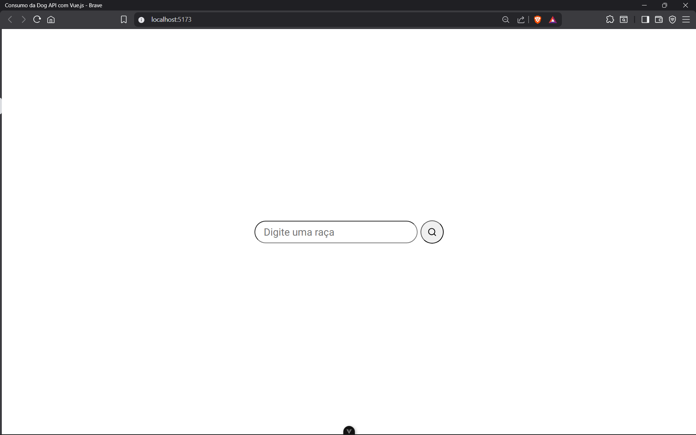
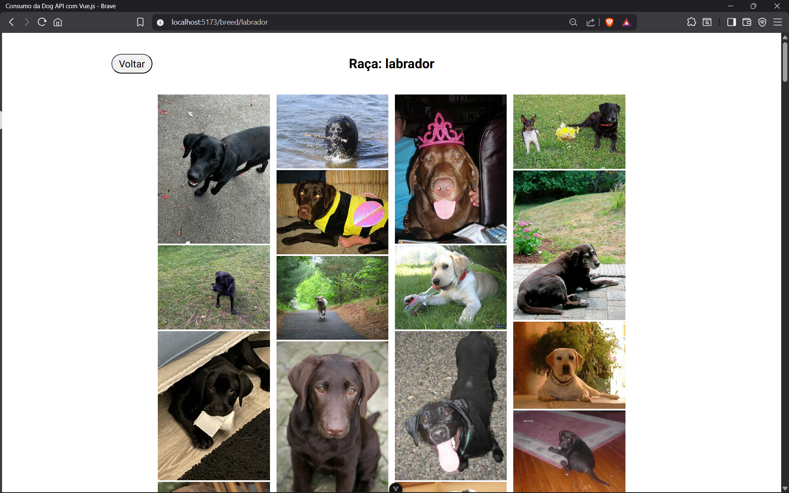

# Vue.js DOG API

> A aplicação tem como finalidade a utilização do Framework Vue.js para a construção de um website que consuma a Dog API.

# Vue.js

## O que é?:

Vue.js é um [framework JavaScript](https://www.alura.com.br/artigos/angular-vs-react-vs-vue-js#frameworks-javascript) progressivo usado para criar interfaces de usuário (UI) e aplicações web SPA ([_Single Page Applications_](https://www.hipsters.tech/single-page-applications-hipsters-16/)).

Surgiu na China e foi Criado por Evan You, procurando uma experiêcia melhor do que os frameworks que estava usando na época - Angular.js e Backbone. Procurando algo mais leve e fácil de aprender.

## Por que utilizá-lo?:

Ele se destaca por sua **curva de aprendizado suave**, ideal para iniciantes, e sua **flexibilidade**, logo, pode ser utilizado em partes de uma aplicação existente (daí o termo *progressivo*) ou para criar, do zero, uma aplicação completa. E também por sua **reatividade**, permitindo que a interface do usuário atualize automaticamente sempre que seus estados mudam.

Álem disso ele é Open Source, sendo disponibilizado sem retrições.

## Cenários não recomendados:

Abaixo estão os cenários onde o uso do Vue.js pode não ser recomendado, baseado em limitações técnicas e de ecossistema:

- **Aplicações "Enterprise" de Altíssima Complexidade**: Embora o Vue possa lidar com grandes projetos (especialmente com Vue 3/Pinia), React e Angular possuem um ecossistema de terceiros mais maduro e maior adoção corporativa. Para aplicações com equipes gigantescas, a estrutura rigorosa do Angular ou a flexibilidade do React podem ser preferíveis.
- **Desenvolvimento Nativo Mobile**: O Vue.js não possui um equivalente direto ao React Native (uma solução madura e oficial) para desenvolver aplicativos nativos. Embora existam alternativas como NativeScript-Vue, o ecossistema é menor e pode não estar pronto para produção em casos complexos.
- **Projetos que Exigem Bibliotecas de Terceiros Muito Específicas:**: O Vue possui menos bibliotecas e plugins disponíveis do que React ou Angular. Se o projeto depender de integrações raras, você pode ter dificuldade em encontrar suporte nativo para Vue.

### Como instalar o Vue.js

Requisitos de ambiente

**Node.js**

Para instalar o Vue.js é necessário que já tenha o Node.js instalado na versão 18.3 ou superior, ele é um ambiente de execução de código javascript, que funciona sem navegador 

Para instala-lo, você pode ir diretamente no site do Node 
https://nodejs.org/en/download

**NPM**

O NPM (node pack manager) é instalado automaticamente junto com o node.js.
Ele é utilizado para gerenciar as dependências e as bibliotecas externas que o Vue vai utilizar.

**VS Code**

Será necessário ter um editor de código, nesse caso, recomendamos o VS Code por ser o mais utilizado e mais fácil para adaptação, mas essa escolha é opcional.

Após a instalação do VS code, vá ao menu de extensões e procure por “Vue (Offical)” e instale, ele dará suporte aos arquivos .vue, também é opcional, porém ajudará na sua experiência

Após isso, reinicie o seu VS Code, depois disso seu ambiente estará pronto para instalar e utilizar o Vue.

### Comando de criação do projeto

Para criar uma aplicação Vue, siga este seguintes passos:

Para abrir o terminal de comandos, clique: ctrl + J

Agora pra criar o seu projeto, digite  **npm create vue@latest** no seu terminal, este comando executará o create-vue, a ferramenta de estruturação do vue com várias funcionalidades opcionais, lembre-se que o “@latest” serve para instalar a última versão do vue, e dependendo da versão atual, o passo a passo pode ser diferente, na versão que estou, esse é o passo a passo

- **Project name:** (em português, “nome do projeto”) é onde você insere o nome do seu projeto. Evite usar caracteres especiais, como símbolos e espaços em branco.
Agora é onde você seleciona as funcionalidades opcionais, utilize as setas do teclado para navegar, espaço para selecionar a opção (fica verde após a seleção), utilize a tecla A para ativar tudo, e aperte Enter para confirmar sua seleção;
- **TypeScript** não selecione para utilizar o Java script, selecione para utilizar o Typescript;
- **JSX Support**  é uma extensão de sintaxe que permite escrever estruturas de interface (UI) usando JavaScript/TypeScript puro, em vez de templates HTML padrão, é utilizado em casos muito raros e complexos, recomendo que não o selecione;
- **Router (SPA development)** Selecione caso precise adicionar navegação entre páginas da sua aplicação;
- **Pinia (state management)** Selecione se precisar de gerenciamento de estados na sua aplicação;
- **Vitest (Unit Testing)** Selecione apenas se você quiser efetuar testes unitários em sua aplicação com Vitest. Alternativamente, existem outras bibliotecas com o mesmo propósito, como [Jest](https://jestjs.io/pt-BR/) ou [Vue Test Utils](https://test-utils.vuejs.org/) ;
- **End-to-End Testing** (em português, “solução para testes de ponta a ponta?”) Selecione apenas se você quiser efetuar testes e2e em sua aplicação;
- **ESLint (error prevention)** O ESLint é um plugin que ajuda a manter boas práticas de código e prevenir erros. Selecione se quiser adicioná-lo ao projeto;
- **Prettier (code formatting)** O Prettier é um plugin que ajuda na organização do seu código. Selecione se quiser adicioná-lo ao projeto.

Agora aperte enter para confirmar suas seleções

Caso você esteja na mesma versão que eu, aparecerá estas funcionalidades experimentais

- **Oxlint** É um linter de código(como o ESLint), utilizado para ajudar a manter as boas práticas e previnir erros, porém é  desenvolvido em Rus e é 50-100 vezes mais rápido que o ESLint além de  funcionar sem necessidade de configurações complexas, focando em encontrar erros críticos automaticamente, selecione caso queira.
- **Replace Prettier with Oxfmt** selecione caso queira substituir o Prettier pelo Oxfmt, que é um formatador baseado em rust, compatível com as regras do prettier mas promete ser até 30x mais rápido do que ele.
- **Vite 8 (beta)** selecione caso queira a próxima versão do Vite. Esta em beta ainda e por isso é melhor evitar, pois contém muitas instabilidades,  e a principal mudanç  desta versão nova do vite é a adoção do **Rolldown** (outro bundler em Rust) no lugar do Rollup/Esbuild, oferecendo builds de produção e servidores de desenvolvimento muito mais rápidos.

Novamente, aperte enter para confirmar suas seleções e continuar o processo.
Após isso, aparecerá uma opção para caso queira pular todo o código de exemplo e iniciar um projeto do Vue vazio, com as setas e o espaço, selecione yes se quiser pular ou selecione No para não pular e ter um código de exemplo, e depois, aperte enter para confirmar

Após confirmar, o Node.JS cria toda estrutura de pastas e arquivos, e algumas configurações, e você terá seu projeto no Vue

Ao finalizar o passo a passo, o Node.JS cria toda a estrutura de pastas e arquivos, bem como algumas configurações, de acordo com as opções selecionadas, e pronto, seu projeto vue já está criado. Vale ressaltar que o projeto criado tem como base o [Vite](https://pt.vitejs.dev/guide/why.html), uma **ferramenta de construção (*build*) de projetos Front-End** que permite o uso do JavaScript em módulos e pré-empacota as dependências do projeto 10 a 100 vezes mais rápido que outras ferramentas, isso resulta em uma experiência de desenvolvimento mais rápida e leve.

### Como executar a aplicação localmente

Após terminar o passo a passo anterior, o próprio node.js vai informar os comandos que você precisa fazer para executar seu projeto, exemplo:

Digite “ cd <nome do seu projeto>” para acessar a pasta do seu projeto recém criado
Digite **npm install** para para instalar as dependências (a lista de dependências fica no arquivo package.json);
Digite “npm run dev” para executar o projeto.

Por fim, no próprio terminal aparecerá o URL que abre localmente o projeto Vue.js, igual no exemplo “Local: http://localhost:<porta>/”

Após esse passo a passo, você já tem tudo que é preciso para criar novas aplicações com Vue.JS.
